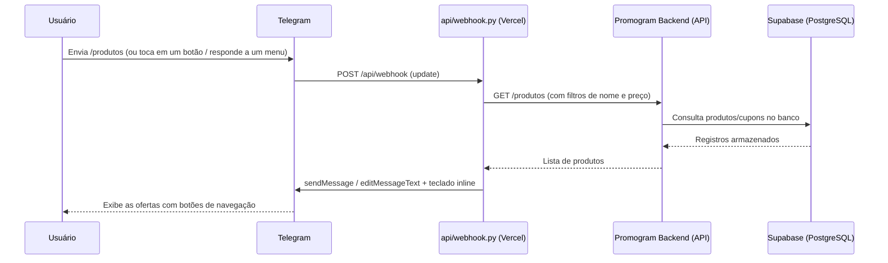

<div align="center">


# Promogram Frontend

**Bot do Telegram que entrega as ofertas e cupons do Promogram para o usuário final**

Este repositório é o "frontend" do Promogram — mas em vez de uma interface web, a experiência do usuário acontece **dentro do próprio Telegram**, através de um bot com menus e botões.

[](https://t.me/promo_hubs_ofertas_bot)

[](https://www.python.org/)
[](https://vercel.com/)
[](https://core.telegram.org/bots/api)
[](LICENSE)

</div>

---

## 📑 Sumário

* [Sobre o projeto](https://www.google.com/search?q=%23-sobre-o-projeto)
* [Como funciona](https://www.google.com/search?q=%23%EF%B8%8F-como-funciona)
* [Funcionalidades](https://www.google.com/search?q=%23-funcionalidades)
* [Comandos do bot](https://www.google.com/search?q=%23-comandos-do-bot)
* [Tecnologias](https://www.google.com/search?q=%23-tecnologias)
* [Estrutura do projeto](https://www.google.com/search?q=%23-estrutura-do-projeto)
* [Pré-requisitos](https://www.google.com/search?q=%23-pr%C3%A9-requisitos)
* [Instalação](https://www.google.com/search?q=%23-instala%C3%A7%C3%A3o)
* [Variáveis de ambiente](https://www.google.com/search?q=%23-vari%C3%A1veis-de-ambiente)
* [Configurando o webhook do Telegram](https://www.google.com/search?q=%23-configurando-o-webhook-do-telegram)
* [Testando localmente](https://www.google.com/search?q=%23-testando-localmente)
* [Deploy](https://www.google.com/search?q=%23%EF%B8%8F-deploy)
* [Projeto relacionado](https://www.google.com/search?q=%23-projeto-relacionado)
* [Licença](https://www.google.com/search?q=%23-licen%C3%A7a)
* [Autor](https://www.google.com/search?q=%23-autor)

---

## 📖 Sobre o projeto

O **Promogram Frontend** é a camada de apresentação do Promogram: um **bot do Telegram** que consulta a [API do Promogram Backend](https://github.com/Victor-Gabriel-Barbosa/promogram-backend) e entrega ofertas e cupons diretamente na conversa do usuário, com menus e botões inline — sem precisar de site ou app.

Ele é implementado como uma **função serverless única** (`api/webhook.py`), hospedada na Vercel, que o Telegram chama via *webhook* toda vez que alguém interage com o bot.

## ⚙️ Como funciona



1. O Telegram envia cada mensagem/clique de botão (*update*) via `POST` para `/api/webhook`.
2. A função valida opcionalmente um segredo (`TELEGRAM_WEBHOOK_SECRET`) para confirmar que a chamada veio do Telegram.
3. O comando, o botão pressionado ou a resposta (reply) a um menu é interpretado (`/produtos`, `/cupons`, busca por nome/preço, navegação de página, menu, etc.).
4. Quando necessário, a função busca dados na API do **Promogram Backend** (`GET /produtos` ou `GET /cupons`, com suporte a filtros combinados de nome, preço mínimo e preço máximo), que por sua vez consulta os dados armazenados no **Supabase**; a função filtra apenas itens `publicado: true` antes de paginar o resultado.
5. A resposta é formatada em HTML e enviada de volta ao usuário via `sendMessage`/`editMessageText`, com teclado inline de navegação contendo os parâmetros de filtro codificados.
6. Por ser serverless, a função só é executada sob demanda — não há processo rodando continuamente.

## ✨ Funcionalidades

* Menu principal com botões inline (Produtos, Cupons, Ajuda, Contato).
* Listagem de **produtos** e **cupons** com paginação (5 itens por página, botões "❮ Anterior" / "Próximo ❯"), preservando múltiplos filtros de busca ao navegar entre páginas.
* **Busca combinada (Nome + Preço)**:
* Funciona enviando o termo junto do comando (`/produtos tênis`) ou respondendo a uma mensagem de menu já enviada pelo bot.
* Para produtos, é possível usar operadores de preço combinados com o nome usando `<` (menor que) e `>` (maior que). Exemplo: `> 100 camisa < 200` ou `celular < 1500`.
* A mensagem de resposta do usuário é apagada automaticamente para manter o chat limpo.


* Edição da própria mensagem ao navegar entre páginas (`editMessageText`), sem poluir o chat com mensagens novas.
* Formatação de preço em real (`R$ 0,00`), incluindo opção parcelada quando disponível.
* Validação opcional do segredo do webhook (`X-Telegram-Bot-Api-Secret-Token`), comparado de forma segura (resistente a timing attacks).
* Tratamento de erros flexível que nunca derruba a função — falhas são apenas logadas.
* Endpoint `GET` de health check (`{"status": "bot ativo"}`) para verificar se o deploy está no ar.
* Implementado sem framework (usa `BaseHTTPRequestHandler` puro), reduzindo dependências e o tempo de cold start na Vercel.

## 💬 Comandos do bot

| Comando | Descrição |
| --- | --- |
| `/start` | Exibe a mensagem de boas-vindas e o menu principal |
| `/produtos [termo]` | Lista as ofertas cadastradas, com paginação. Se um termo for informado (ex.: `/produtos tênis`), filtra pelo nome |
| `/cupons [termo]` | Lista os cupons cadastrados, com paginação. Se um termo for informado (ex.: `/cupons frete grátis`), filtra pelo nome |
| `/ajuda` | Explica como o bot funciona e lista regras de uso dos filtros avançados |
| `/contato` | Mostra o contato de suporte configurado |

Além dos comandos, todos os botões inline (menu, paginação, ajuda, contato) são tratados via `callback_query`. Também é possível fazer buscas complexas de preço respondendo diretamente a uma mensagem de menu (Produtos ou Cupons).

## 🧱 Tecnologias

| Camada | Tecnologia |
| --- | --- |
| Runtime | [Vercel Functions — Python (`@vercel/python`)](https://vercel.com/docs/functions/runtimes/python) |
| Handler HTTP | `http.server.BaseHTTPRequestHandler` (biblioteca padrão do Python) |
| Integração com o Telegram | [Telegram Bot API](https://core.telegram.org/bots/api) via `requests` |
| Integração com o backend | HTTP/JSON contra a API do [promogram-backend](https://github.com/Victor-Gabriel-Barbosa/promogram-backend) |
| Persistência de dados *(no backend)* | [Supabase](https://supabase.com/) (PostgreSQL) — acessado apenas pelo promogram-backend, não diretamente por este repositório |

## 📁 Estrutura do projeto

```text
promogram-frontend/
├── api/
│   └── webhook.py     # função serverless: recebe updates do Telegram e responde
├── requirements.txt   # dependências Python (essencialmente `requests`)
├── vercel.json        # configuração de build/rotas da Vercel
└── LICENSE

```

## ✅ Pré-requisitos

* Python 3.9 ou superior (versão suportada pelo runtime `@vercel/python`).
* Uma conta na [Vercel](https://vercel.com/) para o deploy.
* Um bot criado com o [@BotFather](https://t.me/BotFather) no Telegram, com o respectivo token.
* A [API do Promogram Backend](https://github.com/Victor-Gabriel-Barbosa/promogram-backend) publicada e acessível publicamente, já conectada ao seu banco de dados no Supabase.

## 🚀 Instalação

```bash
git clone https://github.com/Victor-Gabriel-Barbosa/promogram-frontend.git
cd promogram-frontend

python -m venv venv
source venv/bin/activate   # Windows: venv\Scripts\activate

pip install -r requirements.txt

```

## 🔐 Variáveis de ambiente

Configure estas variáveis no painel da Vercel (Project Settings → Environment Variables):

| Variável | Obrigatória | Padrão | Descrição |
| --- | --- | --- | --- |
| `TELEGRAM_BOT_TOKEN` | Sim | — | Token do bot, obtido com o [@BotFather](https://t.me/BotFather) |
| `API_BASE_URL` | Não | `http://localhost:8000` | URL pública da API do promogram-backend |
| `SUPORTE_CONTATO` | Não | `@seu_usuario` | Texto/usuário exibido no comando `/contato` |
| `TELEGRAM_WEBHOOK_SECRET` | Não (recomendado) | — | Segredo usado para validar que a chamada veio mesmo do Telegram |

## 🔗 Configurando o webhook do Telegram

Depois de fazer o deploy (próxima seção) e ter a URL pública em mãos, registre o webhook no Telegram:

```bash
curl -X POST "https://api.telegram.org/bot<SEU_TOKEN>/setWebhook" \
  -d "url=https://promogram-frontend.vercel.app/api/webhook" \
  -d "secret_token=<SEU_TELEGRAM_WEBHOOK_SECRET>"

```

Confirme que o registro deu certo:

```bash
curl "https://api.telegram.org/bot<SEU_TOKEN>/getWebhookInfo"

```

> O parâmetro `secret_token` é opcional, mas se usado deve ser **idêntico** ao valor definido em `TELEGRAM_WEBHOOK_SECRET` na Vercel — é isso que permite ao `webhook.py` rejeitar chamadas que não vieram do Telegram.

## 🧪 Testando localmente

Como a função usa o runtime nativo da Vercel (sem Flask/FastAPI), há duas formas práticas de testar sem publicar antes:

**1. Vercel CLI** (mais fiel ao ambiente de produção)

```bash
npm i -g vercel
vercel dev

```

**2. Chamando a lógica diretamente**, sem subir servidor algum:

```python
from api.webhook import processar_update

update_falso = {
    "message": {
        "chat": {"id": 123456},
        "text": "/produtos",
    }
}
processar_update(update_falso)

```

> Nos dois casos, defina as variáveis de ambiente localmente (`.env` + alguma ferramenta como `python-dotenv`, ou exporte-as no shell) antes de rodar, já que `TELEGRAM_BOT_TOKEN` é lido diretamente de `os.environ` e derruba a importação se ausente.

## ☁️ Deploy

O `vercel.json` já define como a função deve ser publicada:

```json
{
  "version": 2,
  "builds": [
    { "src": "api/webhook.py", "use": "@vercel/python" }
  ],
  "routes": [
    { "src": "/api/webhook", "dest": "api/webhook.py" }
  ]
}

```

Para publicar:

1. Importe o repositório na [Vercel](https://vercel.com/new).
2. Configure as [variáveis de ambiente](https://www.google.com/search?q=%23-vari%C3%A1veis-de-ambiente) no projeto.
3. Faça o deploy — a URL pública ficará em algo como `https://promogram-frontend.vercel.app`.
4. [Registre o webhook](https://www.google.com/search?q=%23-configurando-o-webhook-do-telegram) apontando para `<sua-url>/api/webhook`.

O repositório já mantém uma instância publicada em `promogram-frontend.vercel.app`.

## 🔄 Projeto relacionado

Este bot depende inteiramente da API do **[promogram-backend](https://github.com/Victor-Gabriel-Barbosa/promogram-backend)**, que é responsável por:

* Raspar ofertas e cupons de grupos do Telegram (via Telethon).
* Armazená-los em um banco PostgreSQL hospedado no **[Supabase](https://supabase.com/)**.
* Expô-los através dos endpoints `GET /produtos` e `GET /cupons` (com paginação e filtros via parâmetros da requisição), consumidos por este frontend.

> **Nota:** este repositório (o "frontend") **não se conecta ao Supabase diretamente**. Toda a comunicação com o banco de dados é feita pelo promogram-backend; o `api/webhook.py` apenas consome a API HTTP dele através da variável `API_BASE_URL`.

## 📄 Licença

Distribuído sob a licença **MIT**. Veja [LICENSE](https://www.google.com/search?q=LICENSE) para mais detalhes.

## 👤 Autor

**Victor Gabriel Barbosa**
GitHub: [@Victor-Gabriel-Barbosa](https://github.com/Victor-Gabriel-Barbosa)
